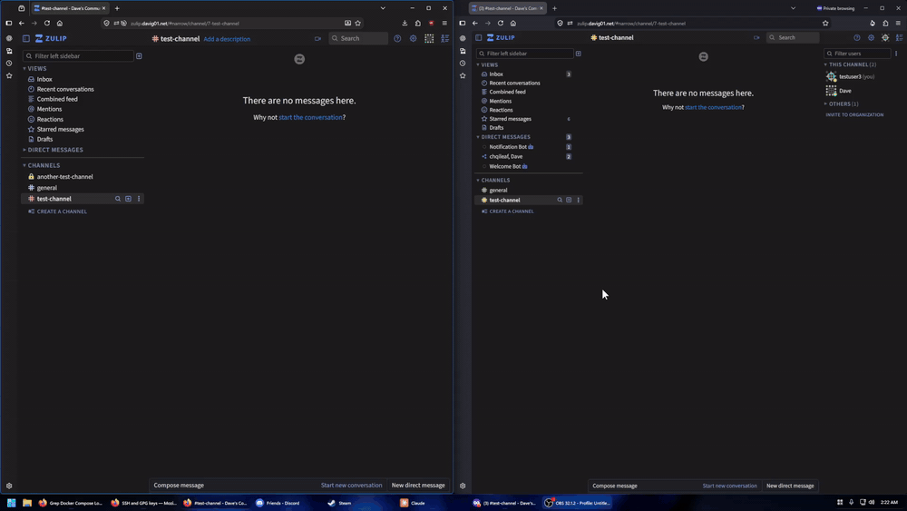

# Zulip Meet

**Conversation-scoped Jitsi video calls in Zulip.** The channel or direct message you are in
decides which Jitsi room you can join — enforced end to end by short-lived, room-scoped tokens —
with the call embedded and minimizable *inside* Zulip. Channels surface who is on a call through a
live, call-aware left sidebar; direct messages get a roster message in the conversation.

Zulip ships a video-call button that opens a Jitsi room with a `Math.random()` name and no access
check: any member of the organization can mint a link to any room. That is harmless while the room
is unauthenticated anyway. This project replaces it with a real entitlement model and builds a
proper in-app calling experience on top.

## Demo



▶ **[Watch the full-quality walkthrough](docs/demo.mp4)** — 1080p60, without the GIF's compression.

<!-- The GIF above (1000px, 20fps, 1.3x speed) renders inline on GitHub from the repo path. For an inline HTML5
     *video* player instead (audio, seeking, smaller than the GIF), drag docs/demo.mp4 into a new
     issue or release comment to get a https://github.com/user-attachments/assets/… URL and paste
     that URL on its own line here. -->

## What it does

- **The conversation is the room.** The server derives an unguessable room name from the
  channel/DM (`HMAC(key, scope‖epoch)`), mints a JWT scoped to exactly that room and tenant, and
  Prosody enforces it. You can only join the Jitsi room for a conversation you actually belong to,
  and the membership check happens on the server — not the client.
- **The call lives in Zulip.** Clicking call opens Jitsi in an embedded panel you can drag around,
  minimize to a bar under the compose box, maximize, or resize — it survives switching channels,
  rather than opening a new tab.
- **A call-aware sidebar (channels).** A channel with a live call shows a speaker icon (a lock for
  private channels) and the participants' avatars — with a ring on whoever is speaking — updated the
  instant someone joins, leaves, or talks, pushed as a real-time client event rather than polled.
  Channels are found this way instead of a posted message.
- **A roster message (DMs & groups).** For a direct message or group, "📹 Call in progress — Ada,
  Bob" is posted into the real conversation and edited as people come and go. It works across DMs
  and organizations — things a bot could not do — because it is authored (as the initiator) through
  a server-internal hook rather than a bot account.
- **Moderator from Zulip roles.** Mute-all / kick is granted only to a channel's admins, carried in
  the token and enforced in Jitsi's Prosody.
- **Rooms rotate.** Bumping an epoch gives a clean "start a fresh meeting" primitive and a recovery
  path if a link ever leaks; rotating the room key rekeys everything at once.

## How it fits together

```
  ┌── click "call" in a channel / DM
  ▼
Zulip server (patched)  ──mint room-scoped JWT──▶  browser ──join──▶  Jitsi / Prosody
  │  membership check                                                    │  validates room+tenant,
  │  derive room, mint token                                             │  grants moderator from token
  │                                                                      │
  │  ◀─────────── occupancy (event_sync) ──────────────────────────────┘
  ▼
core-hook  ◀─ channel: push occupancy → sidebar event · DM/group: post/edit message ─  zulip-meet-conferencing
```

1. Click call → `POST /calls/jitsi/create`: Zulip verifies you belong to the conversation, derives
   the room, and mints a short-lived JWT scoped to that room and tenant.
2. The embedded client joins the Jitsi room with the token; Prosody validates room + tenant and sets
   moderator from the token's claim.
3. Prosody's `event_sync` streams occupancy to **zulip-meet-conferencing**, which owns call state
   and timing. Through Zulip's internal **core hook** it then either pushes a **channel's** live
   roster to the channel's subscribers as a client event — the call-aware sidebar — or, for a **DM
   or group**, posts and edits a roster message authored as the initiator.

## Components

| Directory | What it is |
|---|---|
| [`zulip-meet-conferencing/`](zulip-meet-conferencing/) | The external service: occupancy, call state, timing; the channel occupancy push and the DM/group roster message, both via the hook. Fully tested. |
| [`zulip-server-patch/`](zulip-server-patch/) | The Zulip server changes: the room-derivation + JWT mint, the membership-checked `calls/jitsi/create` endpoint, the internal core-hook endpoints, and the occupancy widget. |
| [`embedded-call/`](embedded-call/) | The in-Zulip embedded call: a `JitsiMeetExternalAPI` iframe at the app root (drag/minimize/maximize/resize), the call-aware sidebar, the in-iframe speaking relay (`jitsi-speaking-relay.js`), and CSP notes. |
| [`jitsi-token-harness/`](jitsi-token-harness/) | A standalone harness that *proves* the isolation — a token for one room or tenant is refused at another — against a real Jitsi/Prosody stack. |
| [`docs/`](docs/) | Architecture (rev4), the Prosody `event_sync` runbook, and deployment notes. |

Prosody-side plugins used: `event_sync` (occupancy → the service), `muc_census` (reconciliation),
`token_affiliation_legacy` + `disable_cascading_set` (moderator strictly from the token), and Jitsi's
own token verification. See `zulip-meet-conferencing/deploy/prosody/` and `docs/`.

## Requirements

- A Zulip server built from [the fork carrying the patch](https://github.com/Dyslectric/zulip-meet-integration/tree/jitsi-jwt) (`zulip-server-patch/`).
- A token-authenticated Jitsi (docker-jitsi-meet) with JWT auth and the custom Prosody plugins.
- The conferencing service, reachable from both Zulip and Prosody on an internal network.

This is a working deployment, not a proof of concept — it runs in production. Deployment specifics
(networking, secrets, the custom images) are in `docs/` and each component's README.

## Status

Live in production: conversation-scoped calls; the embedded draggable/minimizable panel; the
call-aware sidebar (speaker/lock icons, participant avatars, per-user speaking rings, real-time
push); DM/group roster messages; and moderator-from-Zulip-roles. Not built yet: the direct-message
*ringing* flow, and native mobile (a Flutter client is planned).

## License

[Apache-2.0](LICENSE). Zulip and Jitsi are trademarks of their respective owners; this project is an
independent integration and is not affiliated with either.
